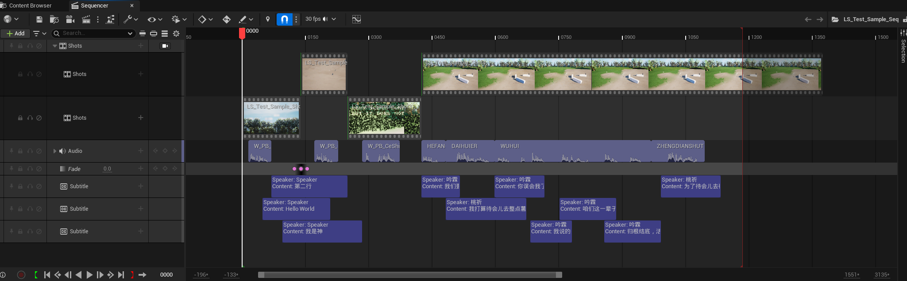
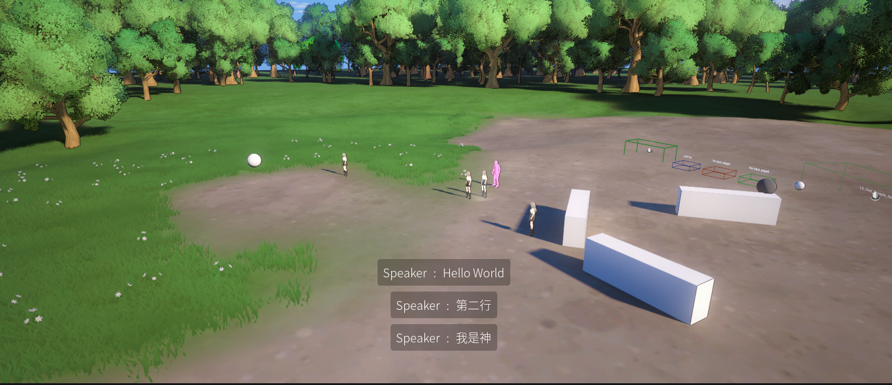

# Dream Sequence Subtitle - 梦月序列字幕

# 发现一个问题 打包之后无法正常显示字幕 待修复

---

## 支持 :

- 关卡序列编辑

- 编辑器实时预览

- 多条字幕显示

- 字幕动画支持

- 字幕自定义UMG

---

## 预览 :

---

## 参考 :

[自定义 Sequencer 轨道开发 &#8211; 五里雾](https://santa.wang/custom_sequencer_track_dev/)

[GitHub - jushuai123/SequenceDialogue: UE sequencer Dialogue tool](https://github.com/jushuai123/SequenceDialogue)

